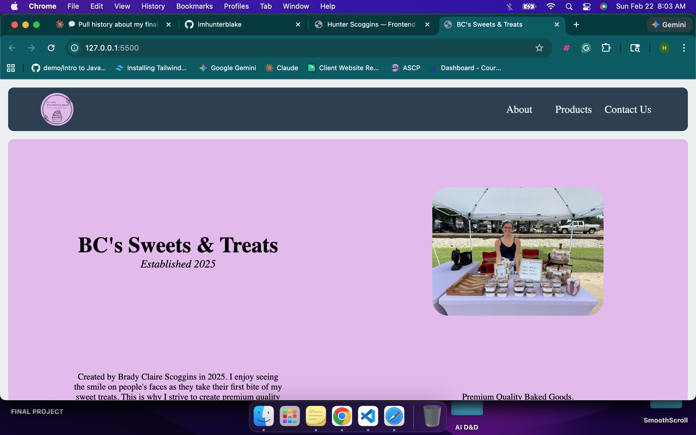

<div align="center">
	<h1>BC's Sweets & Treats</h1>
	<p>
		
		
		
		
	</p>
	<p>A responsive, single-page marketing website for <strong>BC's Sweets & Treats</strong>, showcasing brand story, product offerings, and contact information.</p>
	<p><a href="https://bc-sweets.vercel.app/"><strong>View Live Site</strong></a></p>
	
</div>

## Overview

This project is a static frontend site built with HTML, CSS, and vanilla JavaScript. It includes:

- A sticky navigation bar with mobile menu support
- Section-based single-page layout (`About`, `Products`, `Contact`)
- Product and pricing highlights
- Embedded promotional video content
- Brand imagery and custom styling

## Tech Stack

- **HTML5**
- **CSS3**
- **JavaScript (Vanilla)**

## Project Structure

```text
.
├── app.js
├── index.html
├── styles.css
├── README.md
├── images/
├── screenshots/
└── video/
```

## Getting Started

### 1) Clone the repository

```bash
git clone https://github.com/imhunterblake/BC-Sweets.git
cd BCs
```

### 2) Run locally

Because this is a static site, you can open `index.html` directly in your browser.

For a better development experience, use a local server (recommended):

```bash
# Python 3
python3 -m http.server 8000
```

Then visit: `http://localhost:8000`

## Deployment

This project is currently deployed on **Vercel**:

- https://bc-sweets.vercel.app/

It can also be deployed to other static hosting providers, including:

- GitHub Pages
- Netlify
- Vercel (static export)

## Content & Assets

- Product and brand media assets are stored in `images/` and `video/`.
- Project screenshot used in this README is stored in `screenshots/screenshot.png`.

## Roadmap

- Add online order request form
- Add social media links
- Improve accessibility labels and semantic landmarks

## Contributing

Contributions are welcome. For significant updates, open an issue first to discuss the proposed changes.

## License

No license file is currently included. If you plan to make this project public, consider adding a license (for example, MIT).
